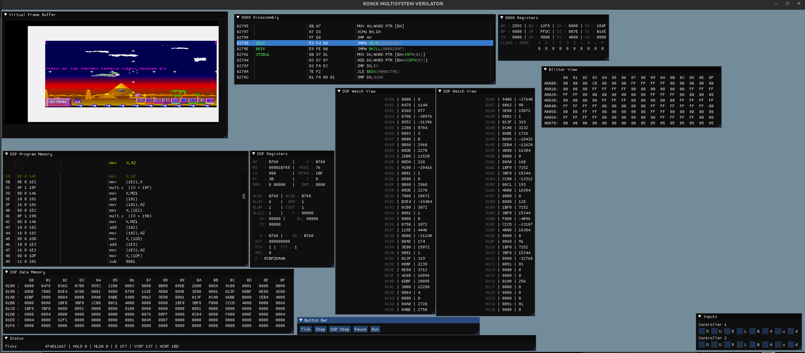

# Konix Multisystem Verilog - TestBenches / Verilator #

This repository is where most of the development of the [Mister Konix Multisystem](https://github.com/SavourySnaX/MiSTer_KonixMultisystem) happens. This repository is a bit of a mess, I tend to dump things into it
as I go along. It uses verilator, and depending on which testbench you use, may also require opengl. I work on this in Linux. The CPU testbenches are part of the [8088 Verilog Core](https://github.com/SavourySnaX/8088_Core) which I've been developing alongside this project.

## Additional Information

Depending on what I`m debugging, I either use gtkwave (and stare at wiggly lines - there are a number of pre-configured .gtkw files that are set up for different purposes). I've also added ImGui and knocked up a "debugger" that allows stepping the cpu/hw/dsp - Beware, the simulation is very slow, for instance I get around 1 Frame every 3-4 seconds.

